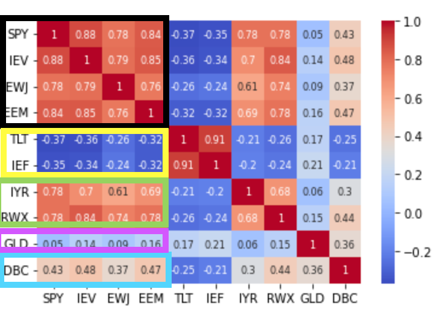
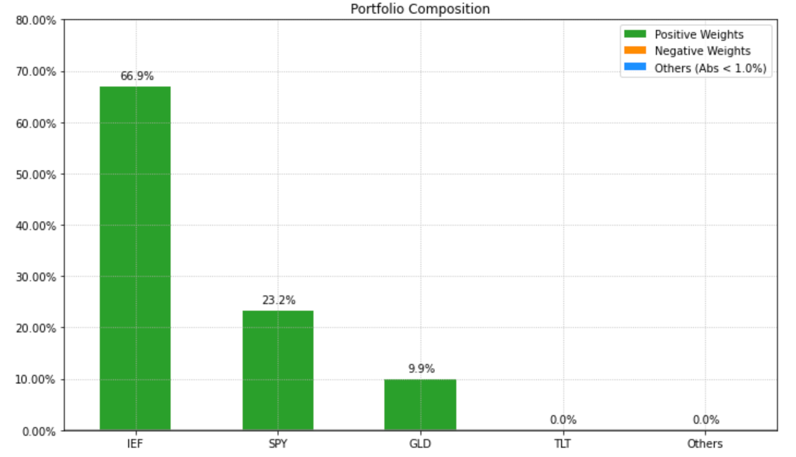
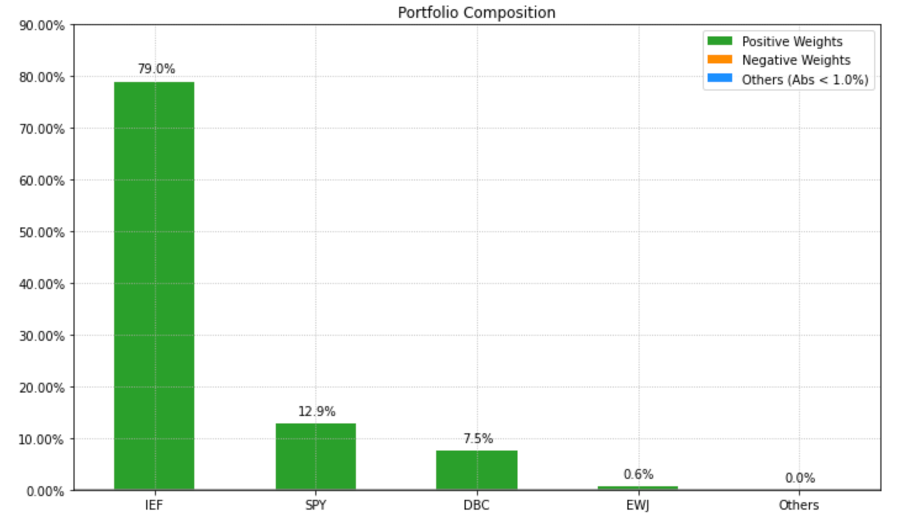
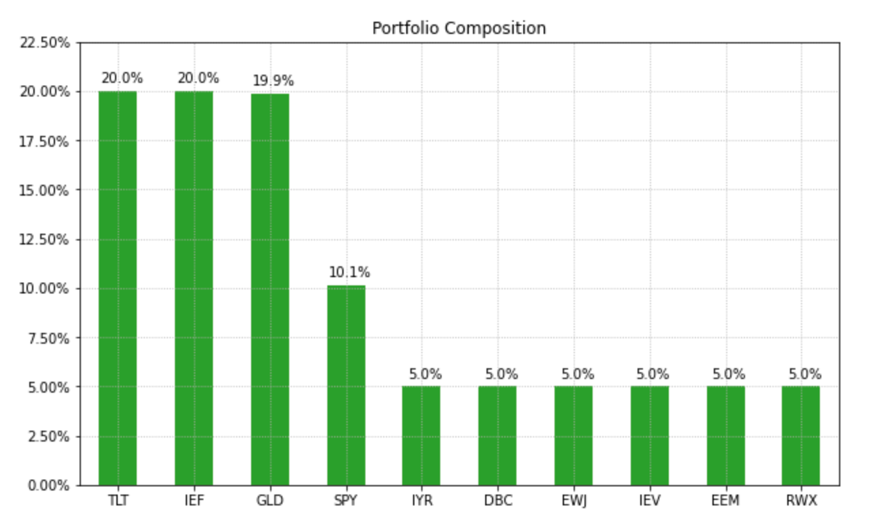

# How to Invest Using Quant

# 0. 글로벌 자산 데이터의 상관관계 보기  
    미국 주식, 유럽 주식, 일본 주식, 이머징 주식, 미국 장기채, 미국 중기채, 미국 리츠, 글로벌 리츠, 금, 원자재
    위 상품들간의 상관관계 보기
> 검은 박스 : 주식 부분  
    노란 박스 : 채권 부분  
    초록 박스 : 리츠 부분  
    보라 박스 : 금  
    파란 박스 : 원자재  
    
</img>   

해당 사진에서 확인할 수 있듯, 주식부분은 서로 상관관계가 높고, 채권은 주식과 상관관계가 낮은 것을 확인할 수 있다.

# Optimization Portfolio (최적의 포트폴리오 구성하기) : OptimizationPortfolio.py   
- 일반적으로 많이 사용되는 `최대샤프지수 포트폴리오`, `최소분산 포트폴리오`, `위험균형 포트폴리오` 구현  

# 1. 최대샤프지수 포트폴리오 (Maximum Sharpe Ratio Portfolio)
- 샤프지수가 최대가 되도록 하는 포트폴리오를 구성하는 것  
- 샤프지수는 포트폴리오의 수익률에서 무위험 수익률을 뺀 후 변동성으로 나눈 값이다.  
- 즉, 위험 대비 수익률이라고도 볼 수 있으며, `샤프지수가 최대가 되는 포트폴리오는 위험은 낮으면서 수익은 높은 지점이다.`
  
</img>   

- 이론적으로 많이 사용되지만, 실무에서는 잘 사용되지 않는다.  
    왜냐하면  
    1. 변동성 및 상관관계는 시간이 지나도 어느정도 유지되는 경향이 있다.
    2. 기대 수익률을 추정하는 것은 매우 어렵다.(실제 투자에서 사용하기는 무리가 있는 가정)
    3. 10개 자산 중 일부 자산으로만 포트폴리오가 구성된다.(즉, 상관관계가 높은 자산이 있으면 하나에만 투자하는 결과를 낳는다.)

## 최대 샤프지수 : 효율적 투자선  
    각 포트폴리오의 기대수익률과 위험수준을 바탕으로 구성할 수 있는 포트폴리오를 나타낸 것
</img>   

# 2. 최소분산
- 목적함수만 최소분산에 해당하는 'MinRisk'로 변경  
</img>   

## 최소분산 : 제약조건 추가하기
- 모든 자산에 최소 투자비중 5%, 최대 투자비중 20% 제약조건을  설정하기  

</img>   

# 3. 위험균형 포트폴리오 (Risk Parity Portfolio)
- 위험기여도는 특정 자산이 포트폴리오 내에서 차지하는 위험의 비중   
- 한계 위험기여도가 큰 자산도 포트폴리오 내에서 비중이 작다면, 포트폴리오 내에서 차지하는 위험의 비중은 작다.  
- 한계 위험기여도가 작은 자산일지라도 비중이 압도적으로 많다면, 포트폴리오 내에서 차지하는 위험의 비중은 크다.
  
따라서 특정 자산이 포트폴리오의 위험을 대부분 차지하는 문제를 막고, 모든 자산이 동일한 위험기여도를 가지는 포트폴리오가 위험균형 포트폴리오다.  

</img>  
</img>  
</img>  