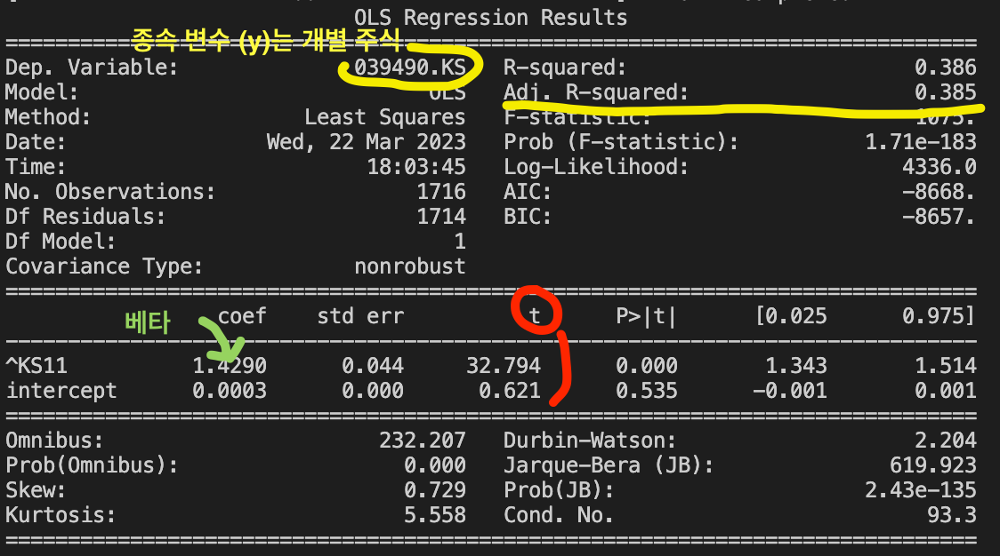

# Portfolio Operation Strategy(포트폴리오 운용 전략) : portfoli_stratagy.py
- 투자 철학 : 규칙에 기반한 투자
- 투자 목적 : 좋은 주식을 매수
- 학문적 기반 : 경제학, 통계학 등
- 투자의 속도 : 느림  
### 팩터  
- 주식의 수익률에 영향을 미치는 특성들을 '팩터'라고 한다.
    즉, 팩터의 강도가 양인 종목의 경우 향후 수익률이 높을 것으로 예성되어 매수한다.  
    반대로 팩터의 강도가 음인 종목의 경우 향후 수익률이 낮을 것으로 예상되어 매수를 하지 않거나 공매도를 한다.  

### 베타  
- 개별주식이 전체 주식시장의 변동에 반응하는 정도를 나태난 값을 베타라 한다.
    예) `베타`가 1일 경우 : 주식시장이 +1%일 경우 개별 주식은 1%의 움직임을 보이고  
    `베타`가 1.5일 경우 : 주식 시장이 +1%일 경우 개별 주식은 +1.5%의 움직임을 보인다는 것  
- 따라서 `상승장`에서는 베타가 큰 주식의 수익률이 좋고, `하락장`의 경우 베타가 낮은 주식의 수익률이 좋다.  

### 선형 회기 분석 그림 `reg.summary()` 설명
</img> 
- 종속 변수 (y) : `Dep. Variable` 부분  
- 베타 : `coef` 부분  
- t-통계값 : `t` 부분 => 절대값이 2보다 크면 통계적으로 유의함

# 밸류 전략(가치주 전략) : value_stratagy.py, value_stratagy_krea_stock.py
- 가치주 효과 : 내재 가치 대비 낮은 가격의 주식(저PER, 저PBR등)이  
    내재 가치 대비 비싼 주식(고PER, 고PBR)보다 수익률이 높은 현상  
- 가치주 효과가 발생하는 원인은 바로 사람들이 가치주를 기피하고 성장주를 선호하기 때문  
> 가치주는 일반적으로 차입비율이 높고, 수익의 변동성이 크며, 경기가 좋지 않을 때 더 위험함  
    사람들은 이처럼 위험한 주식에 필요 이상으로 과민 반응을 보임  
    그로 인해 주가가 하락하고 가치주가 됨  
    반면 인간은 익숙한 것을 안전하다고 착각하는 경향이 있음  
    최근 성과가 좋은 주식은 여러 매체를 통해 접하기 쉽고, 이런 주식을 안전하다고 착각해 많은 사람들이 매수함  
### 프렌치 라이브러리 활용한 데이터 차트 분석
- 모든 지표에서 밸류에이션이 낮을 수록 장기적으로 수익률이 좋다.  
    즉, 가치주에 투자하는 것이 훨씬 수익률이 높다
### 한국의 주식중 각 value를 활용하여 저평가 데이터 20개 뽑기
- ['BPS','PER','PBR','EPS','DIV','DPS']의 벨류에이션을 통한 저평가된 주식 20개 뽑기  
  
  
  

# Momentum Strategy(모멘텀 전략) : momentum_stratagy_1.py, momentum_stratagy_2.py
- 모멘텀이란 주가 혹은 이익의 추세  
    즉, 상승 추세의 주식은 지속적으로 상승하며,  
    하락 추세의 주식은 지속적으로 하락하는 현상  
  
    기업의 이익에 대한 추세를 나타내는 이익 모멘텀과  
    주가의 모멘텀에 대한 가격 모멘텀으로 구분  
  
    일반적으로 과거 12개월 수익률이 높았던 종목이 계속해서 상승하는 현상을 모멘텀이라 함  

- momentum_stratagy_1.py 파일 : 1년간 누적 수익률 엑셀 파일 만들기 및 K-ratio 구하기
- momentum_stratagy_2.py 파일 : 위 파일 이용하여 값 구하기

### 참고 자료 및 출처
- [헨리의 퀀트 대학](https://youtube.com/watch?v=g7lQvtF2SSs&si=EnSIkaIECMiOmarE)
- [French Library](https://mba.tuck.dartmouth.edu/pages/faculty/ken.french/data_library.html)
    - 프렌치 라이브러리에는 (B/M(PBR), E/P(PER), CF/P(PCR)) 데이터도 존재