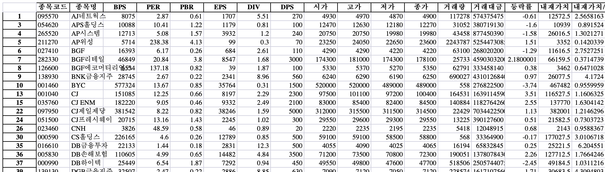
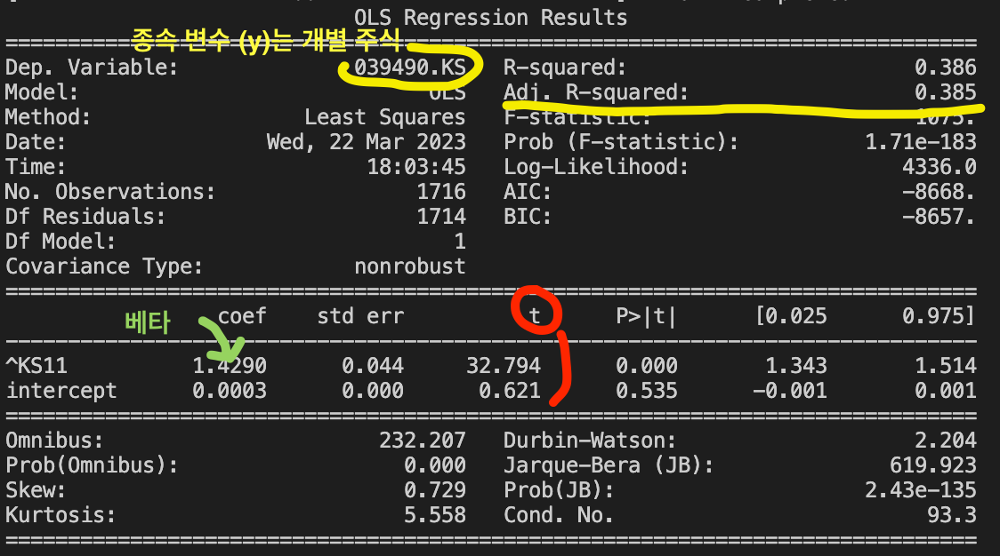
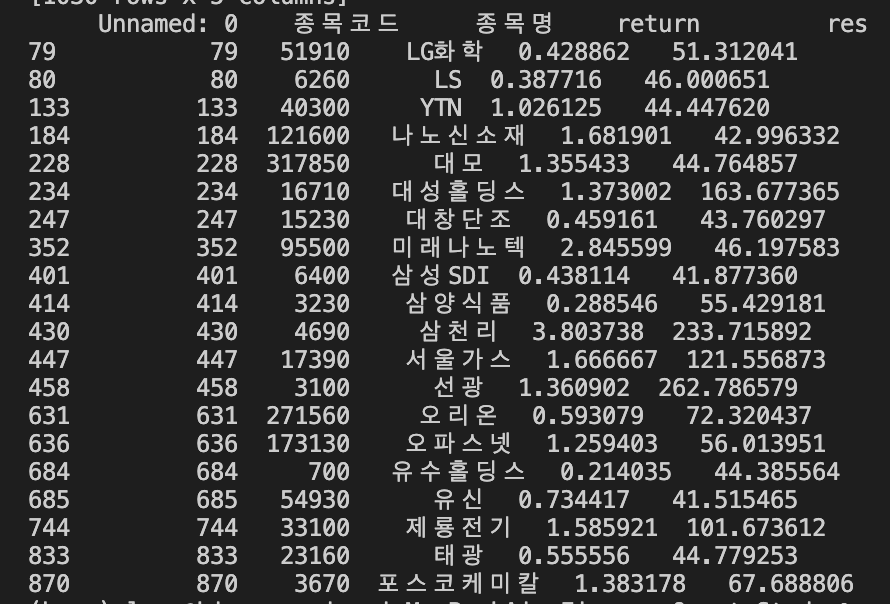

# Finance-Quant-Study
Finance Quant Trading and Analysis Repository

# Get Korea Stock Data
- `Get_Korea_Stock_data.py`  
    한국 주식 데이터 수집 및 엑셀로 저장하기.    
    Saving Korea Stock infomations on excel.  
    </img> 

# QuantStrategy Repository
1. Portfoilo Opertation Strategy  
2. Value Strategy  
3. Momentum Strategy  

</img>
</img>
</img>
