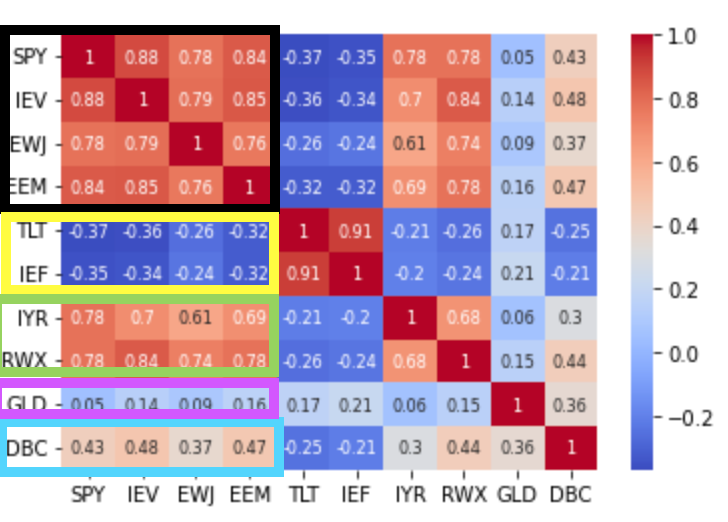

# Finance-Quant-Study
Finance Quant Trading and Analysis Repository

# Get Korea Stock Data
- `Get_Korea_Stock_data.py`  
    한국 주식 데이터 수집 및 엑셀로 저장하기.  
    Saving Korea Stock infomations on excel.  
    => [stocks.xlsx](stocks.xlsx)  
    </img> 

# QuantStrategy Repository  
Look at the detail [Click](/QuantStrategy/)
1. Portfoilo Opertation Strategy  
2. Value Strategy  
3. Momentum Strategy  

</img>
</img>
</img>
  
# HowToInvest Repository
Look at the detail [Click](/HowToInvest/)  
1. Optimization Portfolio
2. Maximum Sharpe Ratio Portfolio
3. Min Risk Portfolio
4. Risk Parity Portfolio  
  
</img>
</img>
</img>
</img>